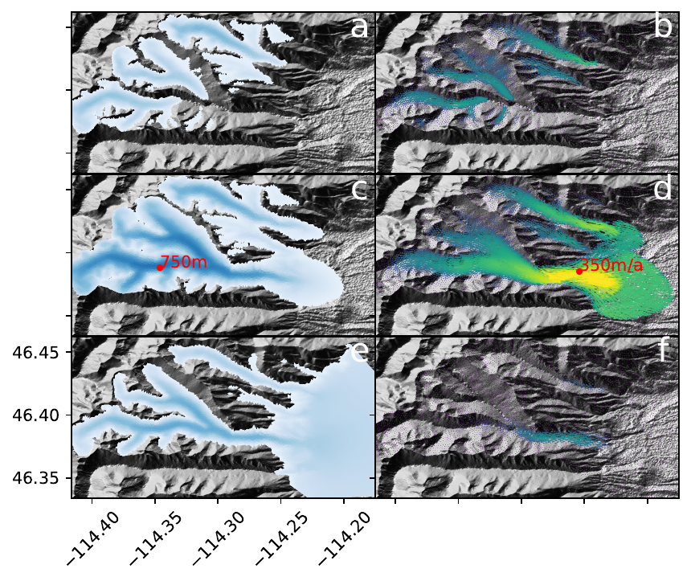

#### SpecEIS ice sheet model code for "Compatible Finite Elements For Glacier Modeling"

----

## Description
This repository contains the code necessary to reproduce the results of the paper "Compatible Finite Elements For Glacier Modeling" by Douglas Brinkerhoff appearing in Computation in Science and Engineering.  The mathematical details of the model appear in the PDF that lives in the repository's main directory, but the highlights of the model are as follows:
 - Firedrake/Python implementation of the Blatter-Pattyn, Shallow Ice, and Shallow Shelf approximations coupled to the continuity equation using Raviart-Thomas-DG0 and Mardal-Tai-Winther-DG0 elements, which exhibit several desirable properties, including local and global mass conservation, monotonicity in the presence of steep solution gradients, and predictable accuracy under mesh refinement
 - Examples highlighting the application of this model to several synthetic examples and one realistic one.  In particular, we hope that the Bear Creek example will give users sufficient guidance for how this model might be applied to their own glacier of choice.  

**Note that this library remains experimental, and should be treated as an Alpha release.**

## Dependencies

The principle dependency of this repository is [Firedrake](https://www.firedrakeproject.org/download.html).  Additionally, we make use of [Numpy](https://numpy.org/install/) (for general array manipulation), [PyTorch](https://pytorch.org/) (for adjoint functionality that is not used in this work, but is generally useful), and [Pickle](https://docs.python.org/3/library/pickle.html) (for saving inputs and outputs).  We also use [Matplotlib](https://matplotlib.org/) for plotting.  Plotting for the bearcreek example uses [Pysheds](https://github.com/mdbartos/pysheds).  

## Installation

This repository does not require installation.  Examples can be run from the "examples" directory assuming that all dependencies are met.    

## Usage

The easiest way to begin is to navigate to the ./examples directory, choose your preferred example, and run the script.  Once computation is complete (which may take some time for some examples), then run the plotting script that appears in the same directory to generate the plots that appear in the manuscript.  

## Getting help

Please contact doug.brinkerhoff@mso.umt.edu with any questions, or use this repository's bug tracker

----

## Open source licensing info
This work is made available under a BSD-3 license.

[LICENSE](LICENSE)

----
